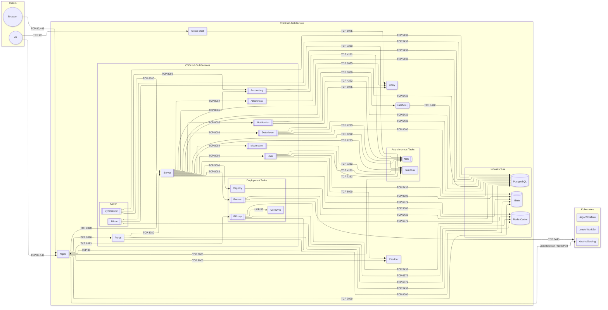

```mermaid
---
config:
  layout: elk
  look: neo
  theme: mc
---
flowchart LR
 subgraph Clients["Clients"]
        Browser(("Browser"))
        Git(("Git"))
  end
 subgraph Kubernetes["Kubernetes"]
        KnativeServing["KnativeServing"]
        Argo["Argo Workflow"]
        LeaderWorkSet["LeaderWorkSet"]
  end
 subgraph Infrastructure["Infrastructure"]
        PostgreSQL["PostgreSQL"]
        Redis["Redis Cache"]
        ObjectStorage["Minio"]
  end
 subgraph Deployment["Deployment Tasks"]
        RProxy[["RProxy"]]
        Runner[["Runner"]]
        Registry["Registry"]
        CoreDNS["CoreDNS"]
  end
 subgraph Asynchronous["Asynchronous Tasks"]
        Nats["Nats"]
        Temporal["Temporal"]
  end
 subgraph Mirror["Mirror"]
        SyncServer[["SyncServer"]]
        MirrorClient[["Mirror"]]
  end
 subgraph CSGHub-SRV["CSGHub SubServices"]
        Portal["Portal"]
        Server["Server"]
        AIGateway[["AIGateway"]]
        Dataviewer[["Dataviewer"]]
        Moderation[["Moderation"]]
        Accounting[["Accounting"]]
        Notification[["Notification"]]
        User[["User"]]
        Mirror
        Deployment
  end
 subgraph CSGHub["CSGHub Architecture"]
        Nginx["Nginx"]
        Casdoor["Casdoor"]
        Infrastructure
        CSGHub-SRV
        Asynchronous
        Gitaly("Gitaly")
        Gitlab-Shell["Gitlab-Shell"]
        Dataflow["Dataflow"]
  end
    Browser -- TCP 80,443 --> Nginx
    Git -- TCP 80,443 --> Nginx
    Git -- TCP 22 --> Gitlab-Shell
    Nginx -- LoadBalancer / NodePort --> KnativeServing
    Nginx -- TCP 8090 --> Portal
    Nginx -- TCP 8080 --> Server & Temporal
    Nginx -- TCP 8083 --> RProxy
    Nginx -- TCP 8000 --> Casdoor
    Nginx -- TCP 9000 --> ObjectStorage
    Portal -- TCP 8080 --> Server
    Portal -- TCP 5432 --> PostgreSQL
    Portal -- TCP 9000 --> ObjectStorage
    Server -- TCP 8086 --> Accounting
    Server -- TCP 8095 --> Notification
    Server -- TCP 8084 --> AIGateway
    Server -- TCP 8093 --> Dataviewer
    Server -- TCP 8089 --> Moderation
    Server -- TCP 8083 --> Runner
    Server -- TCP 7233 --> Temporal
    Server -- TCP 5000 --> Registry
    Server -- TCP 4222 --> Nats
    Server -- TCP 8080 --> User & Dataflow
    Server -- TCP 8075 --> Gitaly
    Server -- TCP 5432 --> PostgreSQL
    Server -- TCP 6379 --> Redis
    Server -- TCP 9000 --> ObjectStorage
    User -- TCP 7233 --> Temporal
    User -- TCP 8000 --> Casdoor
    User -- TCP 4222 --> Nats
    User -- TCP 5432 --> PostgreSQL
    MirrorClient -- TCP 7233 --> Temporal
    MirrorClient -- TCP 6379 --> Redis
    MirrorClient -- TCP 5432 --> PostgreSQL
    Moderation -- TCP 7233 --> Temporal
    RProxy -- UDP 53 --> CoreDNS
    RProxy -- TCP 80 --> Nginx
    RProxy -- TCP 6379 --> Redis
    RProxy -- TCP 5432 --> PostgreSQL
    Dataviewer -- TCP 7233 --> Temporal
    Dataviewer -- TCP 5432 --> PostgreSQL
    Dataviewer -- TCP 8075 --> Gitaly
    Dataviewer -- TCP 9000 --> ObjectStorage
    Accounting -- TCP 4222 --> Nats
    Accounting -- TCP 5432 --> PostgreSQL
    Notification -- TCP 4222 --> Nats
    Notification -- TCP 5432 --> PostgreSQL
    Registry -- TCP 9000 --> ObjectStorage
    Runner -- TCP 6443 --> Kubernetes
    Runner -- TCP 6379 --> Redis
    Runner -- TCP 5432 --> PostgreSQL
    SyncServer -- TCP 8080 --> Server
    SyncServer -- TCP 8086 --> Accounting
    SyncServer -- TCP 5432 --> PostgreSQL
    Gitlab-Shell -- TCP 8075 --> Gitaly
    Dataflow -- TCP 5432 --> PostgreSQL
    AIGateway -- TCP 5432 --> PostgreSQL
    PostgreSQL@{ shape: db}
    Redis@{ shape: db}
    ObjectStorage@{ shape: disk}
    Nats@{ shape: h-cyl}
    Dataflow@{ shape: h-cyl}
```

